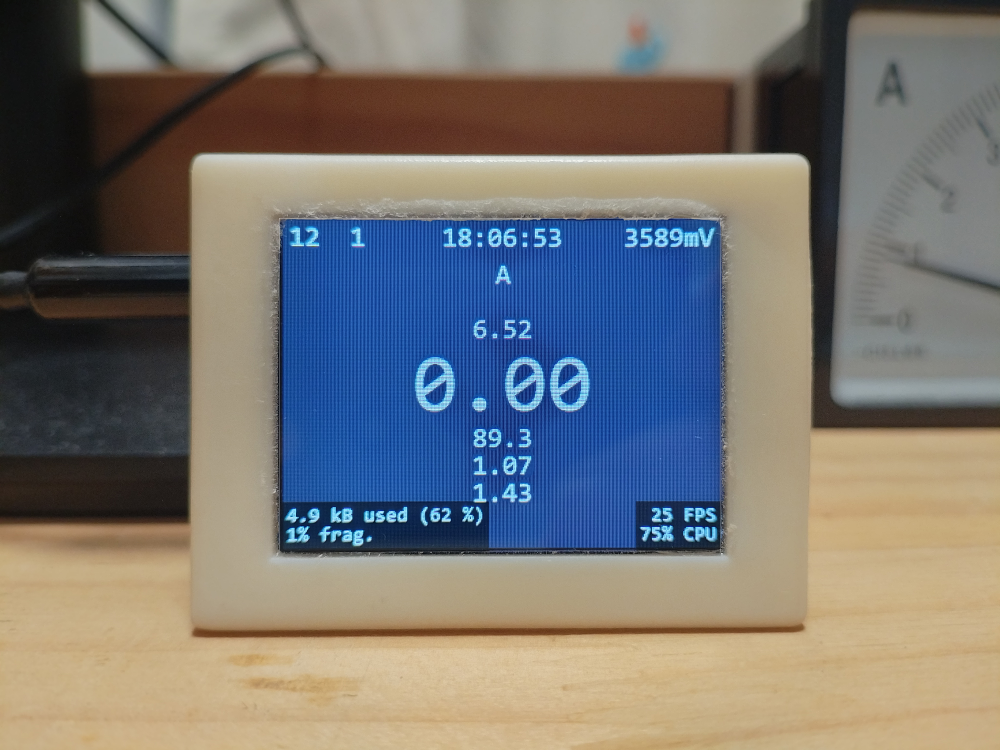
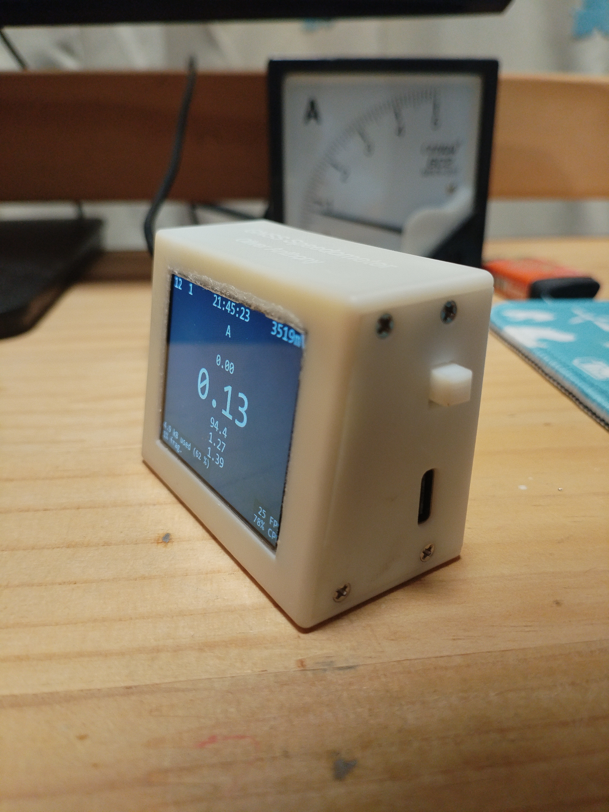
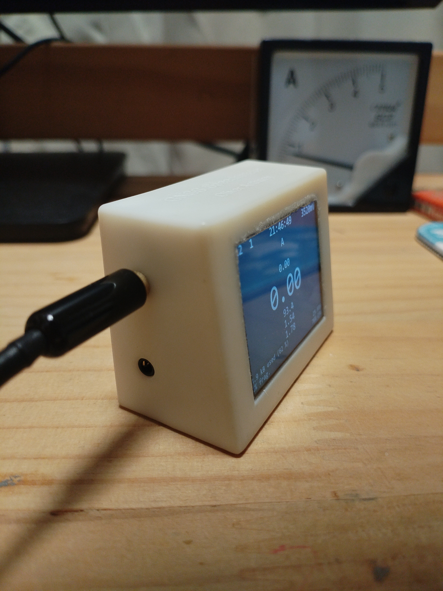
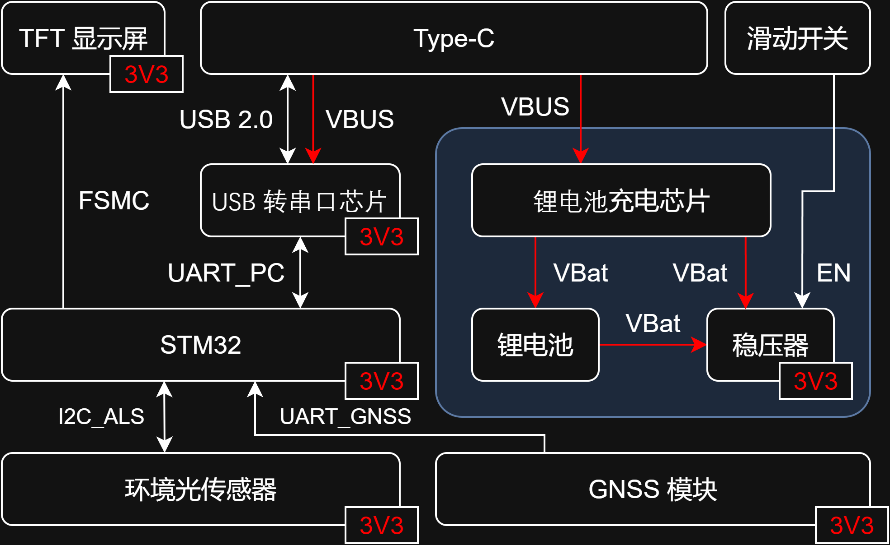
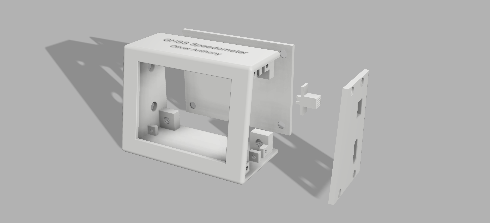

# GNSS Speedometer

> 一款基于 STM32 的便携式 GNSS 测速仪，极简交互，即开即用


市面上的 GNSS 测速仪外壳千篇一律，按键布局繁杂，UI 简陋。所以我做了 GNSS Speedometer —— **开机即显，再无其他。**







## 硬件架构

系统硬件主要由 STM32 主控、GNSS 模块、TFT 显示屏、环境光传感器、USB 转串口及电源管理六部分组成。



**核心硬件清单**

| 名称 | 型号/规格 | 用途 |
|------|-----------|------|
| 主控芯片 | STM32F103VET6 | 核心处理器 |
| GNSS 模块 | E108-GN04G-TTL | 北斗/GPS/GLONASS/GALILEO 多模定位 |
| TFT 显示屏 | 2.0寸 ST7789 240×320 | 显示速度、海拔等信息 |
| 环境光传感器 | LTR-308ALS-01 | 自动亮度调节 |
| USB 转串口芯片 | CH340K | 转发原始 NMEA 数据至 PC |
| 锂电池 | 3.7V 1100mAh + 700mAh（并联） | 总容量 1800mAh，续航约 30 小时 |

## 技术参数

| 参数 | 指标 |
|------|------|
| 主控 | STM32F103VET6 @ 72MHz |
| 屏幕 | 2.0寸 TFT 240×320，FSMC 驱动 |
| 界面刷新率 | 24 FPS |
| PWM 调光 | 10 kHz / 7200 级（无频闪） |
| 环境光检测 | 50 Hz 采样率 |
| 电池 | 3.7V 1800mAh |
| 功耗 | 约 0.2W |
| 尺寸 | 57.2 × 29.7 × 43.4 mm |
| 交互 | 仅一枚滑动开关 |

**几个设计细节**

- **2.5mm 接口连接 GNSS 模块和调试器**：体积小、插拔便捷，便于快速更换不同模块和调试，也有别于 3.5mm 接口防止误插。
- **外壳设计**：Fusion 360 建模，光固化 3D 打印，尺寸 57.2×29.7×43.4 mm。显示模块与水平面成 80° 夹角，全部边缘倒圆角，Type-C 与 2.5mm 接口开孔位置经反复调整。
- **硬件调试**：第一版硬件验证中发现主控用于连接GNSS模块的UART_GNSS与用于连接环境光传感器的I2C_ALS的DMA通道存在冲突，通过飞线进行了修正；内部线缆及电池接口以热熔胶二次加固，防止震动接触不良。



## 软件设计

### DMA 与中断配置

系统涉及 GNSS 串口接收、环境光 I²C 读取、LVGL 定时刷新等多个并发任务。通过合理规划 NVIC 中断优先级，并将 UART、I²C 等通讯接口全部交由 DMA 处理，CPU 仅在中断触发时处理数据，无需参与搬运。这使得系统在 24 FPS 界面渲染的同时，仍能稳定完成数据解析与环境光采样。

### NMEA-0183 协议解析

GNSS 模块输出标准 NMEA-0183 数据，程序解析 `$GPRMC`（速度/航向）、`$GPGGA`（时间/海拔/卫星数）和 `$GPGSA`（HDOP/VDOP）三种语句。

核心的字符串转自定义浮点数函数如下：

```c
static inline decimal_t Str2Dec(const uint8_t *str, uint16_t idx, uint16_t size) {
    decimal_t dec = {0, 0, 0, 0};               // 初始化：符号/整数/小数/精度
    while (str[idx] >= '0' && str[idx] <= '9' && idx < size) {
        dec.integer = dec.integer * 10 + (str[idx++] - '0');    // 解析整数部分
    }
    if (str[idx++] == '.') {                    // 遇到小数点开始解析小数部分
        while (str[idx] >= '0' && str[idx] <= '9' && idx < size) {
            dec.decimal = dec.decimal * 10 + (str[idx++] - '0');
            dec.precision++;
        }
    }
    return dec;
}
```

### LVGL 图形界面

界面分三个层级：

- **顶部**：卫星数、定位状态、当前时间、电池电压
- **中央**：大号字体实时速度（km/h），辅以航向和海拔
- **底部**：定位精度、调试信息

FSMC 并行总线 + DMA 传输，界面刷新率达到 **24 FPS**。

```c
static void disp_flush(lv_disp_drv_t *disp_drv, const lv_area_t *area, lv_color_t *color_p) {
    if(disp_flush_enabled) {
        int32_t flush_size = (area->x2 - area->x1 + 1) * (area->y2 - area->y1 + 1);
        for(uint32_t i = 0; i < flush_size; i++) {
            buf_u8[i * 2] = (uint8_t)(color_p->full >> 8);
            buf_u8[i * 2 + 1] = (uint8_t)(color_p->full & 0xFF);    // 16位数据转8位数据
            color_p++;
        }
        LCD_Address_Set(area->x1, area->y1, area->x2, area->y2);    // 设置刷新窗口
        HAL_DMA_Start_IT(&hdma_memtomem_dma2_channel1, (uint32_t)&buf_u8, LCD_DATA_ADDR, flush_size * 2);    // 启动DMA传输
    }
}
```

## 测试结果

| 测试项目 | 结果 |
|----------|------|
| 冷启动定位时间 | 约 35 秒 |
| 定位后卫星数 | ≥ 12 颗 |
| 速度更新率 | 1 Hz |
| 亮度调节 | 平滑无跳变 |
| 数据转发 | PC 可完整接收 NMEA 流 |

## 关于这个项目

市面上的产品找不到满意的，那就自己做一个。从硬件到软件到外壳，全部由个人独立完成。

这也是我第一次完整经历一个硬件产品的全流程：原理图/PCB 设计 → 嵌入式软件开发（HAL + LVGL）→ 外壳 3D 建模（Fusion 360）→ 光固化 3D 打印 → Git 版本管理。

## 致谢

本项目使用了 [LVGL](https://lvgl.io/) - Light and Versatile Graphics Library  
LVGL 采用 MIT 许可证。